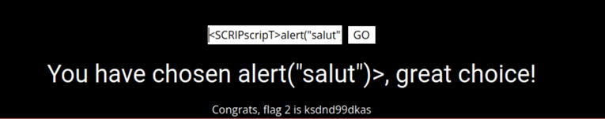
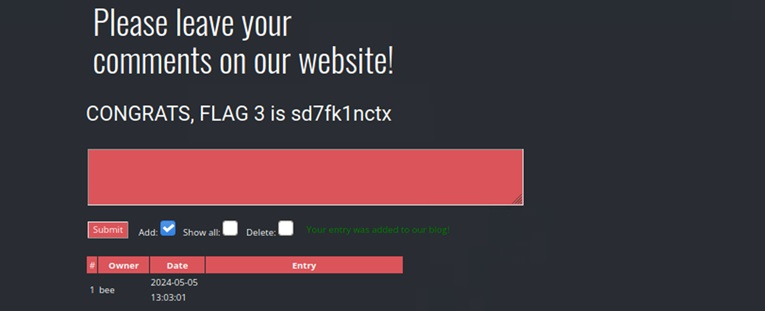
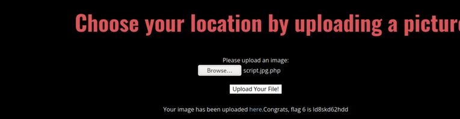
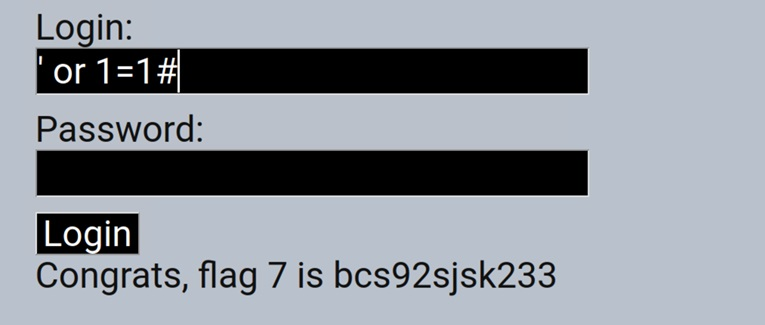
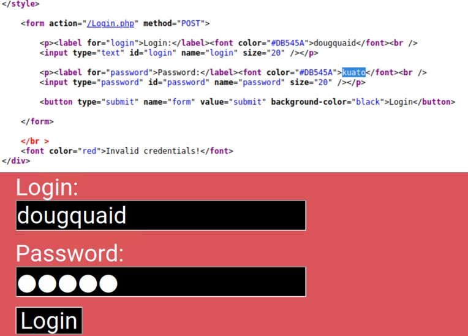
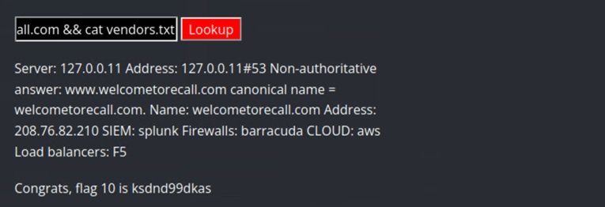
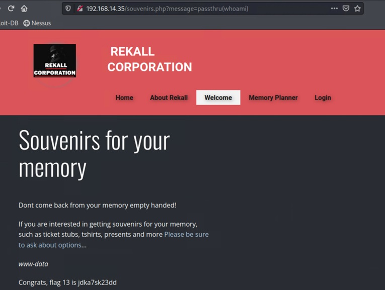
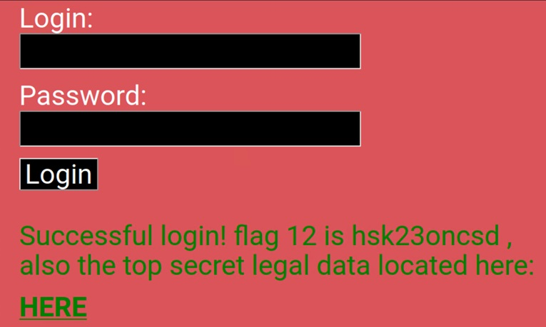
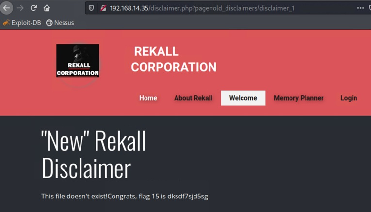
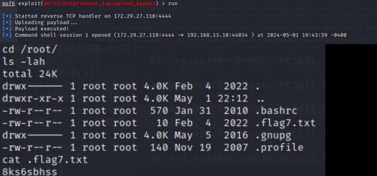

# Cybersecurity-Project-2: Exploit Vulnerabilities in Rekall Corporation's Web Application, Linux Servers, and Windows Servers
For this cybersecurity project, I created a hypothetical company named L'Ordinateur de la Maison (LOM). LOM was authorized by the fictional Rekall Corporation to conduct a vulnerability assessment of Rekall's web application, Linux machine, and Windows machine. Below shows my vulnerability findings for the project. 

By: Kevin D

| Vulnerabilities | Severity |
| --- | --- |
| XSS Reflected  | Medium |
| XSS Stored | Medium |
| Local File Injection | High |
| SQL Injection | Critical |
| Weak Password on Web Application | Critical |
| Command Injection | Medium |
| PHP Injection | Critical |
| Brute Force Attack | Medium |
| Directory Traversal | Medium |
| Apache Tomcat Remote Code Execution Vulnerability | High |
| Shellshock | Critical |
| Struts | High |
| Drupal | High |
| Password Guessing in SSH | Critical |
| Sudo Command Privilege Vulnerability | Critical |
| FTP Anonymous Vulnerability | High |
| Slmail Vulnerability | Critical |
| LSAdump Attack | High |
| WMI Vulnerability | Critical |
| DCSync Attack | Critical |

| Vulnerability 1 | Findings |
| --- | --- |
| Title  | XSS Reflected |
| Type (Web app / Linux OS / Windows OS)  | Web Application |
| Risk Rating | Medium |
| Description | In LOM’s assessment, the ‘Welcome.php’ and the ‘Memory-Planner.php’ pages were evaluated. Utilizing an XSS reflected injection, flags within the web applications were uncovered. The lack of data sanitization and input validation in the web applications allowed LOM to send a malicious XSS reflected code on these two web pages |
| Images |  |
| Affected Hosts | 192.168.14.35/Memory-Planner.php & 192.168.14.35/Welcome.php |
| Remediation | •	Encrypt Sensitive Information. (T1659) •	Restrict Web-Based Content. (T1659)   •	Input Validation. (Stone, Verizon)   •	Data Sanitization. (Stone, Verizon)   •	Utilize Web Application Firewall rules to block abnormal requests. (Stone, Verizon) |

| Vulnerability 2 | Findings |
| --- | --- |
| Title  | XSS Stored |
| Type (Web app / Linux OS / Windows OS)  | Web Application |
| Risk Rating | Medium |
| Description | In LOM’s assessment of the ‘comments.php’ pages, it was found that a XSS stored injection could be created. The lack of data sanitization and input validation in the web applications allowed LOM to send malicious XSS stored code onto this web page. Upon refreshment, the code was still within the page source, leaving a vulnerability that can affect any future visitors to the site. |
| Images |  |
| Affected Hosts | 192.168.14.35/comments.php |
| Remediation | •	Encrypt Sensitive Information (T1659)   •	Restrict Web-Based Content (T1659)   •	Input Validation. (Stone, Verizon)   •	Data Sanitization (Stone, Verizon)   •	Utilize Web Application Firewall rules to block abnormal requests. (Stone, Verizon) |

| Vulnerability 3 | Findings |
| --- | --- |
| Title  | Local File Injection |
| Type (Web app / Linux OS / Windows OS)  | Web Application |
| Risk Rating | High |
| Description | A basic PHP script file was uploaded by LOM. This revealed that the web page was configured to accept various file types, not just image files. Some security measures were in place, as it looked for image keywords like the file type ‘.jpg.’ However, if you added just ‘.jpg’ within the file description, it allowed a malicious payload to be uploaded, in this case, a .php file. |
| Images |  |
| Affected Hosts | 192.168.13.45/Memory-Planner.php |
| Remediation | •	Remove file inclusion input if possible   •	Create a whitelist of files that may be included on the web page. (OWASP, WSTG – v4.1) |

| Vulnerability 4 | Findings |
| --- | --- |
| Title  | SQL Injection |
| Type (Web app / Linux OS / Windows OS)  | Web Application |
| Risk Rating | Critical |
| Description | In the evaluation of the Login.php webpage, it was found that SQL injection attacks were permissible. The following injection was utilized: ‘ or 1=1#. This resulted in the retrieval of flags and additional data that could be utilized for further exploitations. |
| Images |  |
| Affected Hosts | 192.168.13.45/Login.php |
| Remediation | •	Encrypt Sensitive Information (T1659)   •	Restrict Web-Based Content (T1659)   •	Input Validation. (Stone, Verizon)   •	Utilization of Prepared Statements. (OWASP, SQL Injection Prevention Cheat Sheet) |

| Vulnerability 5 | Findings |
| --- | --- |
| Title  | Weak Password on Web Application |
| Type (Web app / Linux OS / Windows OS)  | Web Application |
| Risk Rating | Critical |
| Description | The host 192.168.13.45/Login.php contains a hidden username and password that can be identified by inspecting the web page's source code or by selecting the field after 'Login' and 'Password.' The password itself is also not secure, as both the username and password relate to the film Total Recall, making it easily guessable, even if not plainly visible. |
| Images |  |
| Affected Hosts | 192.168.13.45/Login.php |
| Remediation | •	Account Lockout policy should be created to lock individuals out after a certain number of failed login attempts. (T1110.003)   •	Enable the use of multi-factor authentication. (T1110.003)   •	Use administrative controls to train staff on Password Policies. Use NIST as a password policy guide. (T1110.003)   •	Reset compromised passwords and make sure it is not affiliated with the username.   |

| Vulnerability 6 | Findings |
| --- | --- |
| Title  | Command Injection |
| Type (Web app / Linux OS / Windows OS)  | Web Application |
| Risk Rating | Medium |
| Description | In the evaluation of the networking.php page, command injection vulnerabilities were discovered, allowing access to various directories and files within the web application. This vulnerability has the potential to provide additional data, enabling further exploitation of resources at later times. |
| Images |  |
| Affected Hosts | 192.168.13.45/networking.php |
| Remediation | •	Encrypt Sensitive Information (T1659)   •	Restrict Web-Based Content (T1659)   •	Input Validation. (Stone, Verizon)   •	Data Sanitization. (Stone, Verizon)   •	Utilize Web Application Firewall rules to block abnormal requests. (Stone, Verizon) |

| Vulnerability 7 | Findings |
| --- | --- |
| Title  | PHP Injection |
| Type (Web app / Linux OS / Windows OS)  | Web Application |
| Risk Rating | Critical |
| Description | The following PHP injection was employed by LOM to retrieve credential details from the host 192.168.14.35: 'php?message=passthru(whoami)'. The result returned was www-data is the user account. This indicated that the site was vulnerable to various types of PHP code injection, as parameters like the eval() function were not restricted. If left unaddressed, this vulnerability could result in further exploitation. |
| Images |  |
| Affected Hosts | 192.168.13.35 |
| Remediation | • Data Sanitization. (Stone, Verizon)   • Utilize Web Application Firewall rules to block abnormal requests. (Stone, Verizon)   • Disable Eval to prohibit arbitrary code from being executed. (Moradov, Bright)   • Keep PHP updated with the latest security patches.   • Utilize a Web Application Firewall to filter HTTP requests that may have suspicious patterns. |

| Vulnerability 8 | Findings |
| --- | --- |
| Title  | Bute Force Attack |
| Type (Web app / Linux OS / Windows OS)  | Web Application |
| Risk Rating | Medium |
| Description | By utilizing Burp Suite and the Firefox addon Foxy Proxy, LOM identified the username and password to the host 192.168.13.45. This enabled further identification of usernames and passwords that could potentially be exploited on the web application. This shows that the site does not have adequate password policies, as evidenced by the numerous failed attempts that were permitted during execution. |
| Images |  |
| Affected Hosts | 192.168.13.45/Login.php |
| Remediation | •	Account Lockout policy should be created to lock individuals out after a certain number of failed login attempts. (T1110.003)   •	Enable the use of multi-factor authentication. (T1110.003)   •	Use administrative controls to train staff on Password Policies. Use NIST as a password policy guide. (T1110.003)   •	Reset compromised passwords. |

| Vulnerability 9 | Findings |
| --- | --- |
| Title  | Directory Traversal |
| Type (Web app / Linux OS / Windows OS)  | Web Application |
| Risk Rating | Medium |
| Description | Using prior vulnerabilities discovered in the old_disclaimer directory of the Web Application, LOM successfully employed a path traversal technique on the disclaimer.php page. The following directory traversal command was inputted to show the data from the file: '192.168.13.35/disclaimer.php?page=old_disclaimers/disclaimer_1.txt'. This allowed for the identification of disclaimer text files containing valuable information and flags. |
| Images |  |
| Affected Hosts | 192.168.13.35/disclaimer.php |
| Remediation | •	Adjust file privileges to ensure only authorized users are able to see files and directories.   •	Data Sanitization. (Stone, Verizon)   •	Utilize Web Application Firewall rules to block abnormal requests. (Stone, Verizon) |

| Vulnerability 10 | Findings |
| --- | --- |
| Title  | Apache Tomcat Remote Code Execution Vulnerability |
| Type (Web app / Linux OS / Windows OS)  | Linux OS |
| Risk Rating | High |
| Description | The multi/http/tomcat_jsp_upload_bypass Metasploit module was utilized by LOM to demonstrate the Apache Remote Code Execution vulnerability. This Metasploit module utilizes a PUT request to facilitate the upload of a JSP shell (Rapid7, Tomcat RCE). By configuring the remote host IP address to 192.138.13.10, a meterpreter shell was generated by LOM, granting access to the Linux operating system. |
| Images |  |
| Affected Hosts | 192.168.13.10:80 |
| Remediation | •	Update Apache Tomcat.   •	Remove the ROOT Folder if possible as the vulnerability is limited to the ROOT web application of Apache Tomcat. (Nist, CVE-2023-41080) |

Work Citation: 

Awati, R. Anonymous FTP (File Transfer Protocol). Tech Target. https://www.techtarget.com/whatis/definition/anonymous-FTP-File-Transfer-Protocol 

Bu TechWeb. (2024) Securing FTP Servers. BU Tech Web. https://www.bu.edu/tech/about/security-resources/bestpractice/ftp/ 

Crosser, A. (2023) Understanding the Impact of the new Apache Struts File Upload Vulnerability. Praetorian. https://www.praetorian.com/blog/cve-2023-50164-apache-struts-file-upload-vulnerability/ 

Einoryte, A. (2023) What is Mimikatz? What it can do, and how to protect yourself. NordVPN. NordVPN Link. 

Joyce, K. (2021) What is DCSync Attack? Netwrix. https://blog.netwrix.com/2021/11/30/what-is-dcsync-an-introduction/ 

Microsoft. (2024) Windows Management Instrumentation. Microsoft. https://learn.microsoft.com/en-us/windows/win32/wmisdk/wmi-start-page 

Mitre | Attack: 
-	T1003.006 (2021) (https://attack.mitre.org/techniques/T1003/006/)
-	T1047 (2024) (https://attack.mitre.org/techniques/T1047/)
-	T1110.003 (2024) (https://attack.mitre.org/techniques/T1110/003/)
-	T1659 (2023) (https://attack.mitre.org/techniques/T1659/)

Moradov, O. (2022) PHP Code Injection: Examples and 4 Prevention Tips. Bight. https://brightsec.com/blog/code-injection-php/ 

Nist. (2019) CVE-2019-14287 Detail. Nist. https://nvd.nist.gov/vuln/detail/CVE-2019-14287 

Nist. (2024) CVE-2023-41080 Detail. Nist. https://nvd.nist.gov/vuln/detail/CVE-2023-41080 

OWASP. (2024) SQL Injection Prevention Cheat Sheet. OWASP. https://cheatsheetseries.owasp.org/cheatsheets/SQL_Injection_Prevention_Cheat_Sheet.html 

OWASP. (2024) WSTF – v4.1 Testing for Local File Inclusion. OWASP. OWASP Link. 

Rapid7. (2018) Apache mod_cgi Bash Environment Vairable Code Injection (Shellshock). Rapid 7. https://www.rapid7.com/db/modules/exploit/multi/http/apache_mod_cgi_bash_env_exec/ 

Rapid7. (2018) Apache Struts Jakarta Multipart Parser OGNL Injection. Rapid 7. https://www.rapid7.com/db/modules/exploit/multi/http/struts2_content_type_ognl/ 

Rapid7. (2019) Drupal RESTful Web Services unserialize() RCE. Rapid 7. https://www.rapid7.com/db/modules/exploit/unix/webapp/drupal_restws_unserialize/ 

Rapid7. (2018) Seattle Lab Mail 5.5 POP3 Overflow. Rapid 7. https://www.rapid7.com/db/modules/exploit/windows/pop3/seattlelab_pass/ 

Rapid7. (2018) Tomcat RCE via JSP Upload Bypass. Rapid7. https://www.rapid7.com/db/modules/exploit/multi/http/tomcat_jsp_upload_bypass/ 

Rapid7. (2018) Windows Management Instrumentation (WMI) Remote Command Execution. Rapid 7. https://www.rapid7.com/db/modules/exploit/windows/local/wmi/ 

Red Hat. (2014) Mitigating the Shellshock Vulnerability (CVE-2014-6721 and CVE-2014-7169). Red Hat. https://access.redhat.com/articles/1212303 

Rhett. (2019) CVE-2019-14287 is Out, But a Workaround’s Available. VulCan. https://vulcan.io/blog/cve-2019-14287-is-out-but-a-workarounds-available/ 

Stone, M. (2024) How to Mitigate Cross-Site Scripting. Verizon. https://www.verizon.com/business/resources/articles/s/how-to-mitigate-cross-site-scripting/ 

The Hacker Tools. (2024) Cache. The Hacker Tool. https://tools.thehacker.recipes/mimikatz/modules/lsadump/cache 

